# git practica 2
Taller GIT. Práctica 2.
Guarda los comandos realizados, así como los resultados(capturas), integrarlo dentro del mismo repositorio

## Trabajar con un proyecto HTML y un repositorio local.
- Crea una carpeta practica-taller-git en tu pc.
- Inicializa el repositorio. 
 ```bash
 git init
 ```
 <br>
 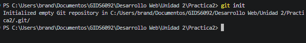
 <br>
 
- Crea el fichero index.html con un html simple.
- Comprueba que el repositorio a detectado el cambio. 
```bash
git status
```
 <br>
 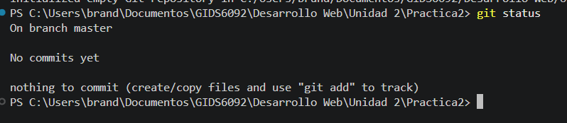
 <br>

- Añade el fichero al stage. 
```bash
git add index.html.
```
 <br>
 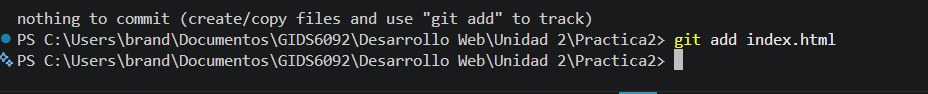
 <br>

- Confirma los cambios. 
```bash
git commit -m “added index file”
```
 <br>
 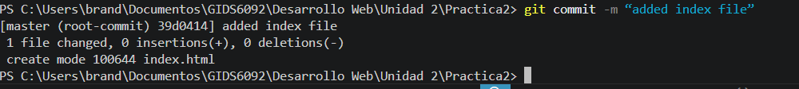
 <br>

- Añade un fichero description.html y edita index.html.
- Comprueba que ha detectado el nuevo fichero y la modificación de index.
```bash
git status
git diff
```
 <br>
 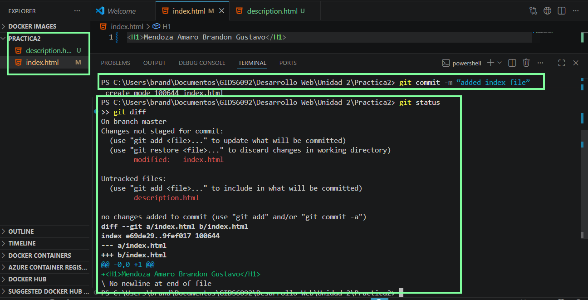
 <br>
 
 <br>

- Crea un fichero TODO.txt de tareas pendientes.
- Comprueba que git ha detectado el nuevo fichero. 
```bash
git status
```
 <br>
 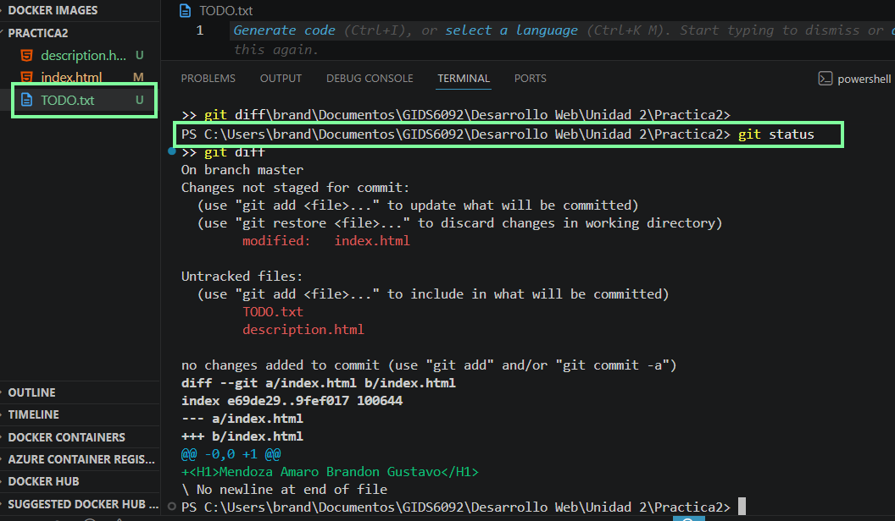
 <br>

- Ignora el fichero TODO.txt ya que es donde anotaremos nuestras tareas personales y no debe formar parte del proyecto. Para ello crea un fichero .gitignore con la linea TODO.txt.
- Comprueba que ya no detecta el nuevo fichero TODO.txt (si que detectara el .gitignore claro). 
```bash
git status
```
 <br>
 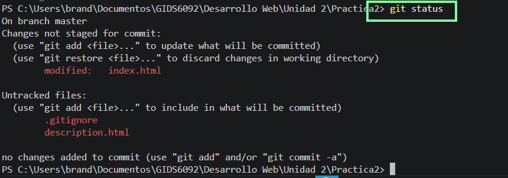
 <br>

- Añade y confirma el .gitignore.
- Puedes continuar añadiendo ficheros html, css e imágenes para probar el repositorio.


## Haz un fork del repositorio creado para la práctica del taller:
- Entra en https://github.com/
- Accede a tu cuenta.
- Accede al repositorio del profesor https://github.com/lalobarri/git-practica-2.git
- Pulsa el botón fork (parte superior derecha) para crearte una copia del mismo en tu cuenta.
- Clona el repositorio en tu equipo *en otra carpeta diferente que la llamaremos 'git-practica-2'*. Quedará algo parecido a lo siguiente:
```bash
git clone https://github.com/[tu-nombre-de-usuario]/git-practica-2.git
```
 <br>
 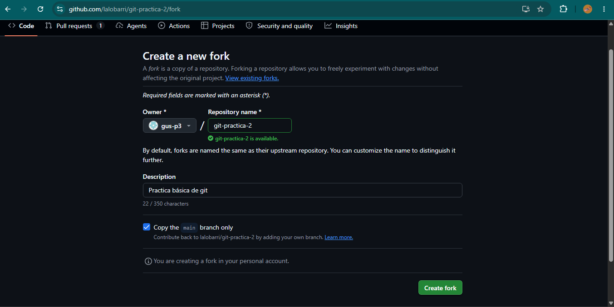
 <br>

- Crea un nuevo fichero en el proyecto que se llame [tu-nombre-de-usuario].html
- Edita el fichero añadiendo como título tu nombre, algún texto y lo que desees en el.
- Añade el fichero al repositorio.
- Súbelo al repositorio remoto (github). 
```bash
git push
```
 <br>
 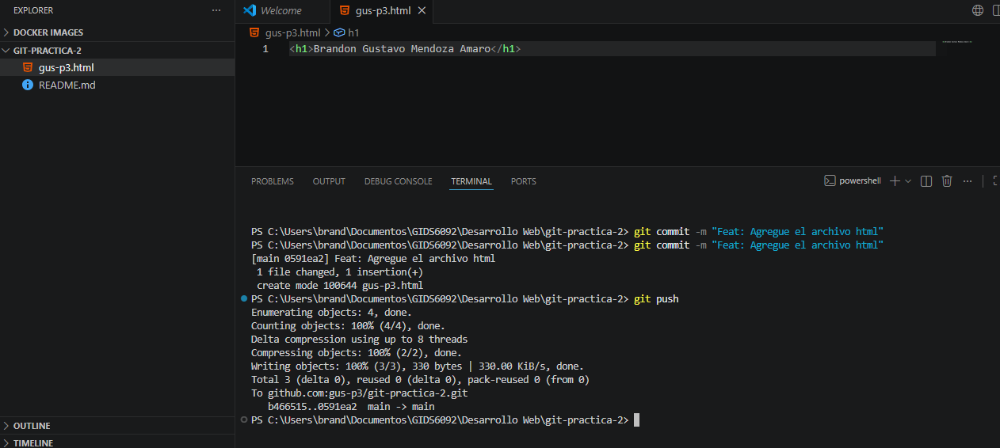
 <br>

- Crea una rama develop y cámbiate a ella.
```bash
git checkout -b develop
```
 <br>
 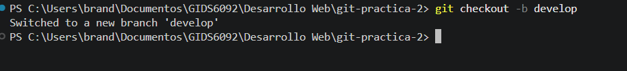
 <br>

- Realiza cambios en el proyecto, confírmalos y súbelos al repositorio remoto.
```bash
git status
git add *
git commit -m "Mensaje del commit..."
git push origin
```
 <br>
 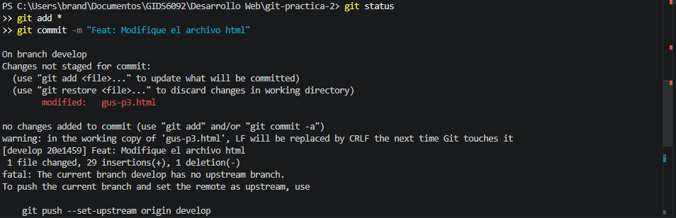
 <br>

- Desde github crea un pull request de la rama develop a main.
- Fusiona la rama develop con en main. No deberías de tener ningún conflicto.
 <br>
 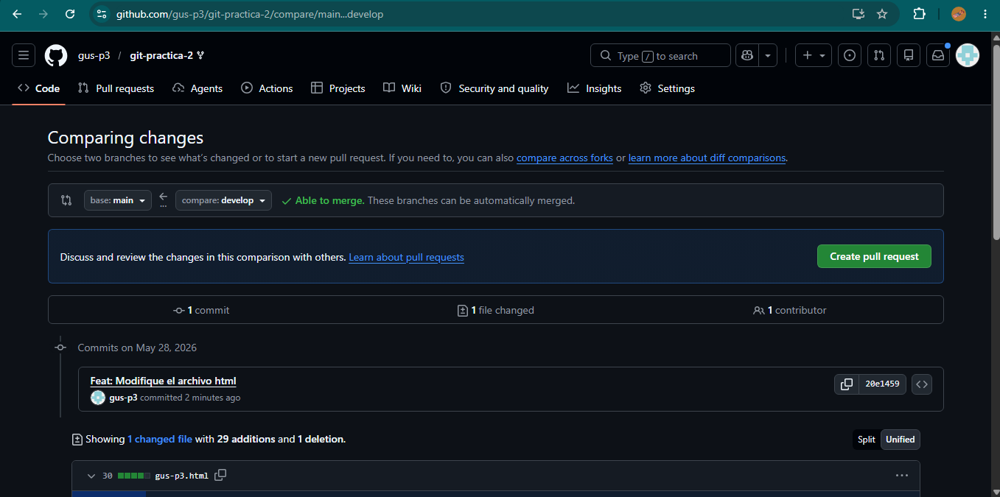
 <br>

- Haz nuevos cambios en el proyecto siguiendo el flujo de trabajo git flow.


## Preguntas
Crea un nuevo fichero respuestas.md, contesta las siguientes preguntas y súbelo a tu repositorio remoto de github:

### 1. ¿Qué sucede cuando hacemos un git add?

Cuando ejecutamos `git add`, añadimos los cambios de los archivos especificados al **staging area** (área de preparación). Git comienza a rastrear estos cambios y los prepara para el próximo commit, creando una instantánea temporal de su estado actual.

---

### 2. ¿Qué sucede cuando hacemos un git commit? ¿Dónde está ese commit?

Cuando hacemos un `git commit`, Git guarda permanentemente la instantánea de los archivos en el staging area dentro de la base de datos local del historial del repositorio. Este commit se encuentra de manera local en tu máquina, dentro del directorio oculto `.git`.

---

### 3. ¿Por qué al hacer git commit todavía no está disponible ese commit en el repositorio remoto?

Porque Git es un sistema de control de versiones distribuido. Un `git commit` es una operación estrictamente local que solo actualiza el historial en tu computadora de desarrollo. No se conecta a internet ni al servidor hasta que ejecutes explícitamente una instrucción de subida.

---

### 4. ¿Qué hay que hacer para que veamos este commit en nuestro repositorio remoto de github?

Debemos enviar el commit local al servidor remoto mediante el comando `git push` (o `git push origin [nombre-de-la-rama]` para especificar la rama).

---

### 5. ¿Qué diferencia hay entre hacer un fork o crear una nueva rama?

*   **Fork:** Es una copia completa e independiente del repositorio de otro usuario creada bajo tu propia cuenta de GitHub a nivel de servidor. Se usa para proponer cambios a proyectos externos de los que no eres colaborador directo.
*   **Rama (Branch):** Es una línea de tiempo paralela de desarrollo dentro del *mismo* repositorio. Se usa internamente por los colaboradores para crear nuevas funciones o resolver bugs sin alterar la rama principal (`main`).

---

### 6. ¿Qué comando se utiliza para crear una nueva rama sin cambiarte a ella?

Se utiliza el comando:
```bash
git branch [nombre-de-la-rama]
```

---

### 7. ¿Cuál es la diferencia entre los comandos git switch y git checkout al trabajar con ramas?

*   `git checkout` es un comando multipropósito antiguo que sirve tanto para cambiar de rama como para restaurar o descartar cambios en archivos.
*   `git switch` es un comando moderno (introducido en la versión 2.23) diseñado específicamente para cambiar de rama, haciendo que la sintaxis sea más clara y segura.

---

### 8. ¿Qué es una rama por defecto (como main o master) y por qué es importante?

La rama por defecto (comúnmente llamada `main` o `master`) es la línea de desarrollo principal y el estado estable del software de un proyecto. Es sumamente importante porque es el punto de partida oficial para cualquier desarrollo y la versión que los usuarios finales o servicios de integración descargan por defecto.

---

### 9. ¿Qué comando te permite ver la lista de todas las ramas locales de tu repositorio?

Se utiliza el comando:
```bash
git branch
```

---

### 10. En el contexto de Git, explica con tus propias palabras qué es una rama (branch) y cuál son sus beneficios principales al trabajar en un proyecto de software

Una rama es como un espacio de trabajo aislado o un "universo paralelo" del proyecto. Su beneficio principal es que permite que múltiples personas trabajen al mismo tiempo en diferentes funcionalidades o correcciones sin interrumpirse mutuamente, manteniendo el código principal a salvo de errores o experimentos inestables.

---

### 11. ¿Qué ha pasado con el contenido de la carpeta practica-taller-git? ¿Por qué no la podemos ver en nuestro repositorio remoto de github?

Esa carpeta fue inicializada como un repositorio local independiente en tu máquina y nunca fue vinculada a un repositorio remoto en GitHub. Al no tener un "remote origin" configurado para esa carpeta en particular, GitHub no tiene conocimiento de ella. Solo podemos ver el repositorio `git-practica-2` que sí fue clonado directamente desde GitHub.
